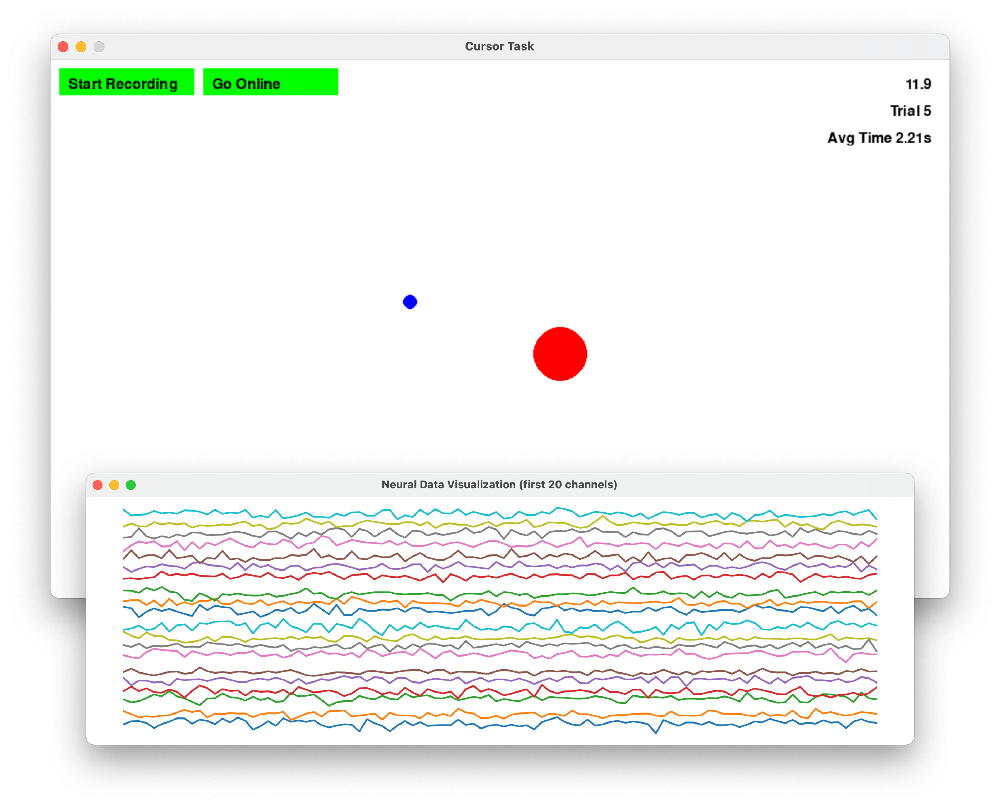

# BCI Simulator
<p align="center">
  
</p>

BCI simulator is a lightweight simulator for closed-loop brain-computer interfaces (BCIs), with the goal of simplicity 
and being easily modifiable. It's designed for researchers to quickly test out decoder algorithms and get a "feel" for 
how they might work in a closed-loop setting. It could also be helpful tool to teach students about the implementation 
of closed-loop, real-time BCIs. Currently, we have two tasks implemented: a 2D cursor task and a 5-finger hand task.


There are three main components to the simulator:
- **Task**: the task is the environment that the user interacts with. These are defined in the `/tasks` folder.
  - In the 2D cursor task, the user has to move the cursor to hit a target. 
  - In the 5-finger hand task, the user controls finger positions of a virtual hand. We use Google Mediapipe to track
    finger positions from a webcam.
- **Input:** inputs include the mouse, hand finger tracking, a decoder (see pipelines below), or any other input devices. 
The decoder is the algorithm that takes in neural data and predicts user intentions (movements). 
We give examples for RNN and ridge regression decoders. Inputs sources are defined in the `/inputs` folder and decoder
models are defined in the `/decoders` folder.
- **Neural Generator**: the neural generator creates artificial neural data using kinematics (position & velocity) as input. 
We currently implement a simple log-linear tuning model, but plan to add more complex models in the future. This is defined
in the `neuralsim.py` file.

<br>

Note that in trying to keep the simulator simple and easily modifiable, we don't optimize for performance and we don't
simulate neural data at the spike level (instead simulating at the bin level). For a more realistic real-time simulator,
we highly recommend checking out the [AE Studio Neural Data Simulator](https://github.com/agencyenterprise/neural-data-simulator) and 
[BRAND/Ali et al. 2023](https://www.biorxiv.org/content/10.1101/2023.08.08.552473v1.full). 
However, with the current design we get 7-10 FPS doing simultaneous hand tracking & decoding on an M1 Macbook Pro, and 
significantly faster for the cursor task.

[//]: # (![cursor simulator]&#40;docs/img/cursortask.png&#41;)
<p align="center">
  
</p>


## Installation
Clone the repository:
```
git clone https://github.com/jtcostello/bcisimulator.git
cd bcisimulator
```

Create a conda environment and activate:
```
conda create -n bcisimulator python=3.9
conda activate bcisimulator
```

Option 1 - Install packages needed for just the simple cursor task:
```
python -m pip install -r requirements_simple.txt
```

Option 2 - Install all packages (for both the cursor and hand tasks). This involves installing requirements (including
Google Mediapipe) and downloading the Mediapipe hand tracking model:
```
python -m pip install -r requirements_full.txt
wget -q https://storage.googleapis.com/mediapipe-models/hand_landmarker/hand_landmarker/float16/1/hand_landmarker.task -O mediapipe_hand_landmarker.task
mkdir inputs/models
mv mediapipe_hand_landmarker.task inputs/models/
```


## Example Usage

### 1. Collect movement data

Run the 2d cursor task on center-out or random targets, using the mouse as input:
```
python main_run_task.py -t cursor -tt centerout
OR
python main_run_task.py -t cursor -tt random
```
Run the 5-finger hand task (uses your webcam to track finger movements):
```
python main_run_task.py -t hand
```
Recorded datasets are saved in the `/data/movedata` folder. Feel free to rename the files.

### 2. Train a decoder (this also creates a neural data simulator)

Train a ridge regression decoder with 5 history bins (100 channels, neural noise of 0.1):
```
python main_train_decoder.py -c 100 -n 0.1 --seq_len 5 -d dataset_20231012_250sec_random.pkl -o cursorridge1 --decoder_type ridge
```

Train an RNN decoder (100 channels, neural noise of 0.1, trained for 30 epochs):
```
python main_train_decoder.py -c 100 -n 0.1 --epochs 30 -d dataset_20231012_250sec_random.pkl -o cursorrnn1 --decoder_type rnn
```
Decoders are saved in the `/data/trained_decoders` folder.

### 3. Test the decoder in closed-loop (simulating neural data in real time)

Run the 2d cursor task on random targets, using a decoder as input:
```
python main_run_task.py -t cursor -d cursorrnn1 -tt random
python main_run_task.py -t cursor -d cursorridge1 -tt random
```
Run the 2d cursor task like above, but use 80% integrated velocity and 20% position for decoded output:
```
python main_run_task.py -t cursor -d rnndecoder1 -tt random -b 0.8
```
Run the 5-finger hand task, using a decoder as input:
```
python main_run_task.py -t hand -d rnndecoder1
```

View all the available command line arguments:
```
python main_run_task.py --help
python main_train_decoder.py --help
```


## Simulator design notes
#### Real-Time Clocking/Timing
- For now, we don't incorporate any precise clocking/timing in the desire for simplicity. 
In the cursor task, the update rate is determined by the `clock.tick(FPS)` command within the task loop
(a pygame command). In the hand task, the max update rate is also set by `clock.tick(FPS)`, but the actual update rate
is usually much slower (7-12 fps).

- We simulate neural data at the bin level, rather than the spike/ephys level. 
For example, we use 20ms timesteps, so that the neural data generated is the average firing rate over a 20ms bin.
This minimizes the amount of data that needs to be generated and processed.

#### Neural Simulation
- The `LogLinUnitGenerator` simulates channels using a log-linear relationship, as in 
[Trucollo et al. 2008](https://www.jneurosci.org/content/28/5/1163.short). This makes
it easy to generate an arbitrary number of degrees-of-freedom (whereas cosine tuning typically is for 2D).
- A new neural simulator is created for each new decoder. This means if you train two decoders with the same neural
settings, they will have different neural data, and could have different performance. In the future we may add the 
ability to use the same neural generator for multiple decoders.
- Neural simulators approximate the random tuning we see in real neural data - they are by no means an accurate
physiological model. Our simulated signals lack many real features, like a large variance related to trial timing.
- The `neural_noise` parameter sets the std of the noise added to the average firing rate.
- Two ways of changing the information content of the neural data: (1) change the number of channels and/or (2) change 
the neural noise level.

## Parameters to explore
A few system/decoder parameters that may be interesting to explore:
- **Time History**: how many previous timesteps of neural data to use as input to the decoder. 
Increased time history typically improves offline accuracy, but usually harms closed-loop performance.
- **Neural Noise & Number of Channels**: increasing neural noise adds more variability to the generated neural data,
and increasing the number of channels increases the amount of information available to the decoder.
- **Decoder Architecture**: many groups have turned toward deep learning approaches for BCI decoders
- **Training Data**: How much training data is needed? Is random targets or center out targets better? You might notice
a tendancy of the RNN decoder to overfit if trained only on center-out targets.
- **Simulated neural data**: We currently implement a simple log-linear tuning model, but more realistic models could be used.

## Relevant research papers
(not at all an exhaustive list, just a few relevant papers)

A key challenge in the design of real-time BCI algorithms is how the offline accuracy of the decoder does not 
directly indicate how well it will perform in a closed-loop setting. 

**Importance of incorporating closed-loop feedback in BCI simulations:**
- Koyama et al. 2010
- Zhang and Chase 2018
- [Cunningham et al. 2011](https://journals.physiology.org/doi/full/10.1152/jn.00503.2010)
- [Willet et al. 2019](https://www.nature.com/articles/s41598-019-44166-7)

**Simulating Neural Data:**
- Liang et al. 2020, Deep Learning Neural Encoders for Motor Cortex
- Wen et al. 2021, Rapid adaptation of brain–computer interfaces to new neuronal ensembles or participants via generative modelling
- Awasthi et al. 2022, Validation of a non-invasive, real-time, human-in-the-loop model of intracortical brain-computer interfaces


## Todo / Future work
- Add online recalibration (ReFIT)
